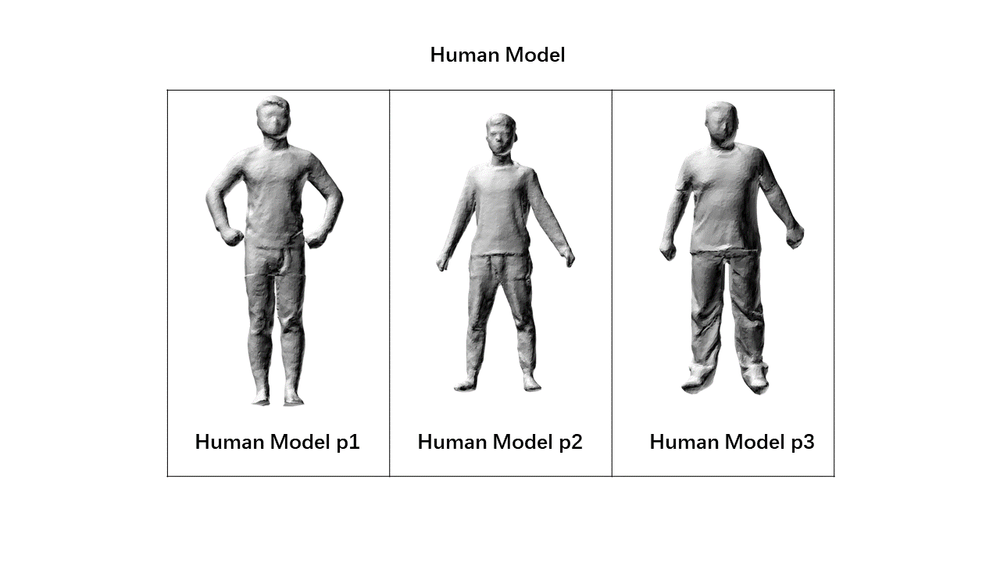
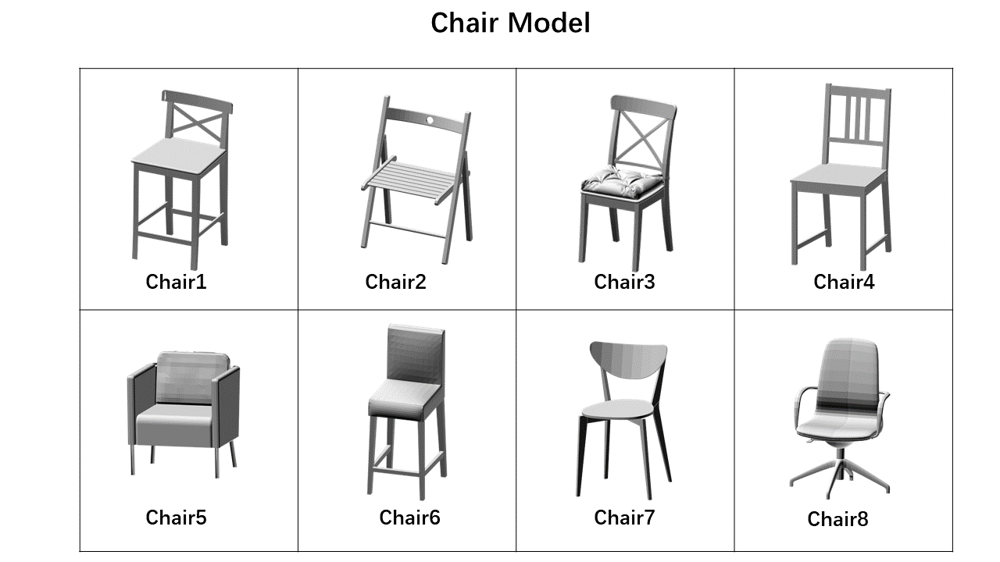

# AutoSittingPoseGenerate
AutoSittingPoseGenerate is an open source project for the fit between humans’ anthropometric characteristics and the functionality of chairs. It is developed based on the VS2015.It is the original implementation of paper `Automatic Sitting Pose Generation for Ergonomic Ratings of Chairs`.  
 
We would like to hear from you if you appreciate this work. 
 
In our project, we provide 3 human models and 8 chair models for example and you can choose them for the experiment. In the RenderResult folder we provide the render result for each human model and chair model.The number of the human models and the chair models are as follows. 

 
To run the demo, you may install OpenMesh at first. If you want run the demo directly, you can run the `HumanSegmentation.exe` in the AutoSittingPoseGenerate\Sourcecode\ReshapeCode\Reshape\HumanSegmentation\x64\Release.  
 
If you want use the other chair model, you may put the obj model in the folder called chairX(X is the number of the chair) and then put the folder into the ChairModel folder. 
 
If you want use the other human model, it may a little bit complex. You’d better use it as follow: 
 
(1)	Convert your human model format to ‘.off’ and then put the model into the \Sourcecode \auto_rigging \Pinocchio-master \x64 \Release and run the Pinocchio.exe. Then you need change the name to the skedata_pX.bin(X is the number of the human model). 
 
(2)	Open the OFF2HKS.m in MATLAB and change the address of the human model. Then input the command OFF2KS(‘name.ply’) in the command window. You need also change the output document name to hks_pX.txt. 
 
(3)	Open the curvature.m in MATLAB and change the input document address. Then you may change the output document name to curvature_pX.txt.  
 
(4)	After the steps above you may put the human model into the HumanModel folder and put skedata_pX.bin, hks_pX.txt and curvature_pX.txt into \Sourcecode\ReshapeCode\Reshape\HumanSegmentation\x64\Release. 
(5)	After build the solution, you can run the HumanSegmentation.exe and choose the model you want.  
 
Please contact the author for questions and bug report, or consulting for the usage of this code base.
